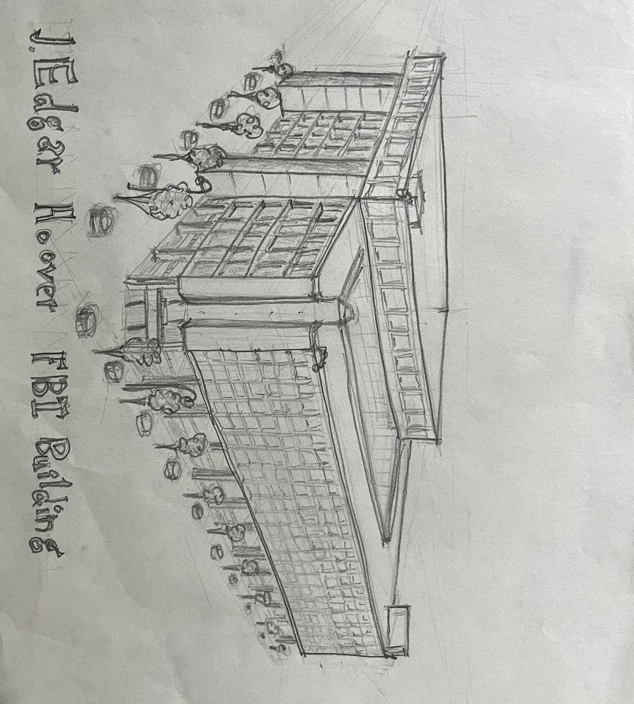
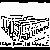

# PixilateIt
A program to transform images into json data files of binary points.
This package's intended use is to take a hand drawn image on a white background and extract the pixels of the drawing into an arbitrary re-sized image

## Project status
This is a demo project, has no warranty, is not supported and generally only exists because the author though it was sort of interesting.


Original Image


Pixilated Image


### Optional Json Results writen
keys are the index of each point, values are tuple with the row, column for each non-white pixel
```
{0: (1, 0), 1: (1, 1), 2: (1, 2), ...}
```

Installation (using python 3.11), recommended installation into a virtual environment.
+ Clone the repository
+ cd into the PixilateIt with the poetry.toml fill
+ pip install .


## Usage in the command line
```shell
python PixelateIt tests//resources//JEdgarBuilding.jpg --s 10 10 --r 90
```

### Options

writes results by default to results.json in directory where program is launched
+ Use --json flag to write json results
+ -s int, int defines the resizing of the image.
+ -r int, defines degree of rotation of the image.
+ -t defines the threshold to binerize, automatically defected if left blank. between 0-254, smaller number means results in more pixels


### Testing
use tox in shell
